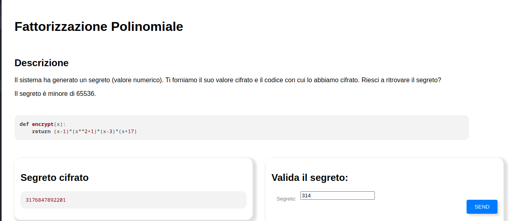

## Title

Fattorizzazione Polinomiale

## Platform

Olicyber

## Url

https://training.olicyber.it/challenges#challenge-559

## Category

Crypto

## Difficult

Stupid

## Step




We have the cypher text [**3176847892201**] and the max secret value (**65536**)

So simple copy the script and brute force the x


## Solution

```Python

def decrypt(x):
    return (x-1)*(x**2+1)*(x-3)*(x+17)


cypher_value = 3176847892201
for i in range(65536):
    if(decrypt(i) == cypher_value):
        print(f"The secret is: {i}")

```
