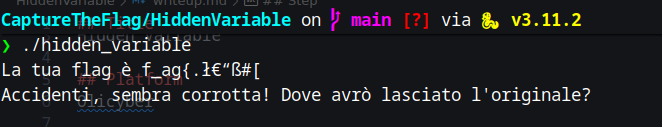
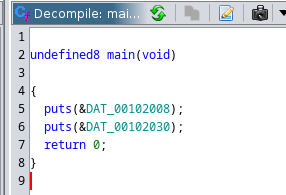

## Title

Hidden Variable

## Platform
Olicyber

## Url

https://training.olicyber.it/challenges#challenge-96

## Category

Software/Binary

## Difficult

Easy

## Step

1. Download the file and make it executable
2. Make the classic routine to run strings and readelf and analyse the file elf
3. Now run the file and the output is:



As simple as that, the programmes print text and finish executing, now read the track and open Ghidra.

**Track: I can no longer find my variable :(, could you give me a hand?**

When we open Ghidra and click on the main function, we see



So the main function prints the 2 strings and returns, so we find ourselves with the output

The trace mentions a hidden variable and not seeing it in functions, the alternatives are two, the first is to search the entire disassembled code for the flag or to check global variables via ghidra.
At one point we can see the variable 'fl4g', which is technically exactly what we are looking for, in fact if we look at the contents we can see a sort of array of characters.

```Text

                             fl4g                                            XREF[1]:     Entry Point(*)  
        00104020 66 00 00        undefine
                 00 6c 00 
                 00 00 61 
           00104020 66              undefined166h                     [0]                               XREF[1]:     Entry Point(*)  
           00104021 00              undefined100h                     [1]
           00104022 00              undefined100h                     [2]
           00104023 00              undefined100h                     [3]
           00104024 6c              undefined16Ch                     [4]
           00104025 00              undefined100h                     [5]
           00104026 00              undefined100h                     [6]
           00104027 00              undefined100h                     [7]
           00104028 61              undefined161h                     [8]
           00104029 00              undefined100h                     [9]
           0010402a 00              undefined100h                     [10]
           0010402b 00              undefined100h                     [11]
           0010402c 67              undefined167h                     [12]
           0010402d 00              undefined100h                     [13]
           0010402e 00              undefined100h                     [14]
           0010402f 00              undefined100h                     [15]
           00104030 7b              undefined17Bh                     [16]
           00104031 00              undefined100h                     [17]
           ..... MORE

```


## Solution

Now that we have the bytes of the flag, all we have to do is take the information and decode it. We can see that the array is "corrupted" and has extra information that we don't need, and this doesn't allow us to do a conversion directly with ghidra (at least I didn't manage it because I don't know ghidra very well, I usually do crypto), so an alternative is to copy the data as a python list, which ghidra allows us to do without any problem

**And the output should look something like this**

```Python

[ 0x66, 0x00, 0x00, 0x00, 0x6c, 0x00, 0x00, 0x00, 0x61, 0x00, 0x00, 0x00, 0x67, 0x00, 0x00, 0x00, 0x7b, 0x00, 0x00, 0x00, 0x75, 0x00, 0x00, 0x00, 0x6e, 0x00, 0x00, 0x00, 0x75, 0x00, 0x00, 0x00, 0x35, 0x00, 0x00, 0x00, 0x33, 0x00, 0x00, 0x00, 0x64, 0x00, 0x00, 0x00, 0x5f, 0x00, 0x00, 0x00, 0x76, 0x00, 0x00, 0x00, 0x34, 0x00, 0x00, 0x00, 0x72, 0x00, 0x00, 0x00, 0x35, 0x00, 0x00, 0x00, 0x5f, 0x00, 0x00, 0x00, 0x34, 0x00, 0x00, 0x00, 0x72, 0x00, 0x00, 0x00, 0x33, 0x00, 0x00, 0x00, 0x5f, 0x00, 0x00, 0x00, 0x35, 0x00, 0x00, 0x00, 0x37, 0x00, 0x00, 0x00, 0x31, 0x00, 0x00, 0x00, 0x31, 0x00, 0x00, 0x00, 0x5f, 0x00, 0x00, 0x00, 0x63, 0x00, 0x00, 0x00, 0x30, 0x00, 0x00, 0x00, 0x6d, 0x00, 0x00, 0x00, 0x70, 0x00, 0x00, 0x00, 0x31, 0x00, 0x00, 0x00, 0x6c, 0x00, 0x00, 0x00, 0x33, 0x00, 0x00, 0x00, 0x64, 0x00, 0x00, 0x00, 0x7d, 0x00, 0x00, 0x00 ]

```

So simply, we translate all the bytes to char and ignore the null bytes.

**Final script**


```Python

bytes_list = [ 0x66, 0x00, 0x00, 0x00, 0x6c, 0x00, 0x00, 0x00, 0x61, 0x00, 0x00, 0x00, 0x67, 0x00, 0x00, 0x00, 0x7b, 0x00, 0x00, 0x00, 0x75, 0x00, 0x00, 0x00, 0x6e, 0x00, 0x00, 0x00, 0x75, 0x00, 0x00, 0x00, 0x35, 0x00, 0x00, 0x00, 0x33, 0x00, 0x00, 0x00, 0x64, 0x00, 0x00, 0x00, 0x5f, 0x00, 0x00, 0x00, 0x76, 0x00, 0x00, 0x00, 0x34, 0x00, 0x00, 0x00, 0x72, 0x00, 0x00, 0x00, 0x35, 0x00, 0x00, 0x00, 0x5f, 0x00, 0x00, 0x00, 0x34, 0x00, 0x00, 0x00, 0x72, 0x00, 0x00, 0x00, 0x33, 0x00, 0x00, 0x00, 0x5f, 0x00, 0x00, 0x00, 0x35, 0x00, 0x00, 0x00, 0x37, 0x00, 0x00, 0x00, 0x31, 0x00, 0x00, 0x00, 0x31, 0x00, 0x00, 0x00, 0x5f, 0x00, 0x00, 0x00, 0x63, 0x00, 0x00, 0x00, 0x30, 0x00, 0x00, 0x00, 0x6d, 0x00, 0x00, 0x00, 0x70, 0x00, 0x00, 0x00, 0x31, 0x00, 0x00, 0x00, 0x6c, 0x00, 0x00, 0x00, 0x33, 0x00, 0x00, 0x00, 0x64, 0x00, 0x00, 0x00, 0x7d, 0x00, 0x00, 0x00 ]


def decode(bytes_list:list) -> str:
    s = ''
    for byte in bytes_list:
        if(byte != 0x00):
            s = s + chr(byte)
    return s


if __name__ == '__main__':
    flag = decode(bytes_list)
    print(flag)

```