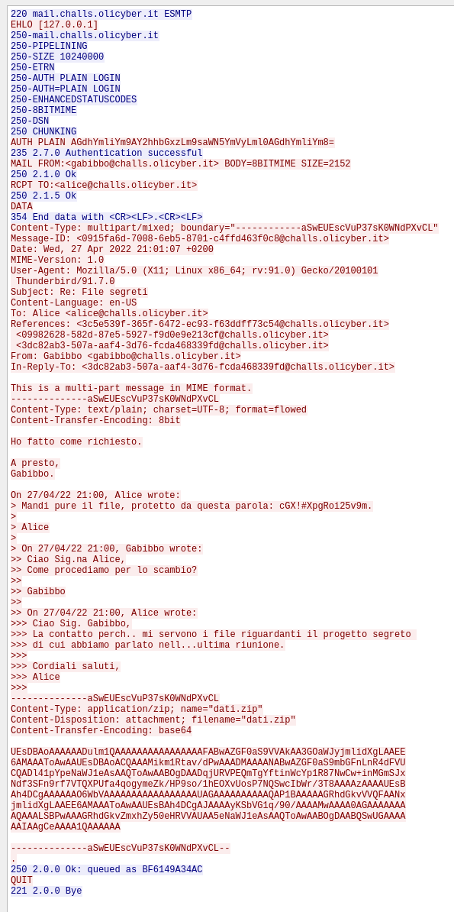

## Title

IlPostino

## Platform
Olicyber

## Url

https://training.olicyber.it/challenges#challenge-277

## Category

Network

## Difficult

Easy

## Step

1. The first thing to do is to open wireshark and load the file once done I strongly recommend reading the problem trace
2. The trace tells us: 'Simple' is in the name of the protocol so it should not be difficult!
3. This clue makes us think of two possible protocols the first and least likely is SNMP (Simple Network Management Protocol) and the most probable is SMTP (Simple Mail Transfer Protocol) which is exactly what we are looking for in fact if we filter for this protocol we see that the packets to be analysed decrease drastically


## Solution and analysis
Looking carefully at the packages we find our complete target in fact wireshark can recompose the packages to simplify reading them and we should find one with this content



- The first part concerns authentication between the two intermediaries 
- The second part concerns a conversion with sensitive data in fact we can see a password that we will probably need later to access a zip file, **Password**: ```cGX!#XpgRoi25v9m```
- Finally, the last part and the one to be analysed best is the zip file

```Plaintext
--------------aSwEUEscVuP37sK0WNdPXvCL
Content-Type: application/zip; name="dati.zip"
Content-Disposition: attachment; filename="dati.zip"
Content-Transfer-Encoding: base64

UEsDBAoAAAAAADulm1QAAAAAAAAAAAAAAAAFABwAZGF0aS9VVAkAA3GOaWJyjmlidXgLAAEE
6AMAAAToAwAAUEsDBAoACQAAAMikm1Rtav/dPwAAADMAAAANABwAZGF0aS9mbGFnLnR4dFVU
CQADl41pYpeNaWJ1eAsAAQToAwAABOgDAADqjURVPEQmTgYftinWcYp1R87NwCw+inMGmSJx
Ndf3SFn9rf7VTQXPUfa4qogymeZk/HP9so/1hEOXvUosP7NQSwcIbWr/3T8AAAAzAAAAUEsB
Ah4DCgAAAAAAO6WbVAAAAAAAAAAAAAAAAAUAGAAAAAAAAAAQAP1BAAAAAGRhdGkvVVQFAANx
jmlidXgLAAEE6AMAAAToAwAAUEsBAh4DCgAJAAAAyKSbVG1q/90/AAAAMwAAAA0AGAAAAAAA
AQAAALSBPwAAAGRhdGkvZmxhZy50eHRVVAUAA5eNaWJ1eAsAAQToAwAABOgDAABQSwUGAAAA
AAIAAgCeAAAA1QAAAAAA
--------------aSwEUEscVuP37sK0WNdPXvCL--
```

Analysing the content, we can note 1 important thing, namely that the data representing the zip file is in base64 and that we should convert it correctly to do this I recommend doing a python script directly

```Python
import base64

base64_data = """
UEsDBAoAAAAAADulm1QAAAAAAAAAAAAAAAAFABwAZGF0aS9VVAkAA3GOaWJyjmlidXgLAAEE
6AMAAAToAwAAUEsDBAoACQAAAMikm1Rtav/dPwAAADMAAAANABwAZGF0aS9mbGFnLnR4dFVU
CQADl41pYpeNaWJ1eAsAAQToAwAABOgDAADqjURVPEQmTgYftinWcYp1R87NwCw+inMGmSJx
Ndf3SFn9rf7VTQXPUfa4qogymeZk/HP9so/1hEOXvUosP7NQSwcIbWr/3T8AAAAzAAAAUEsB
Ah4DCgAAAAAAO6WbVAAAAAAAAAAAAAAAAAUAGAAAAAAAAAAQAP1BAAAAAGRhdGkvVVQFAANx
jmlidXgLAAEE6AMAAAToAwAAUEsBAh4DCgAJAAAAyKSbVG1q/90/AAAAMwAAAA0AGAAAAAAA
AQAAALSBPwAAAGRhdGkvZmxhZy50eHRVVAUAA5eNaWJ1eAsAAQToAwAABOgDAABQSwUGAAAA
AAIAAgCeAAAA1QAAAAAA
"""

base64_data_cleaned = base64_data.strip()

zip_data = base64.b64decode(base64_data_cleaned)

with open("dati.zip", "wb") as zip_file:
    zip_file.write(zip_data)

print("File 'dati.zip' extract and saved successfully.")
```

Once the file has been saved, simply open it, access the data and enter the password found previously.