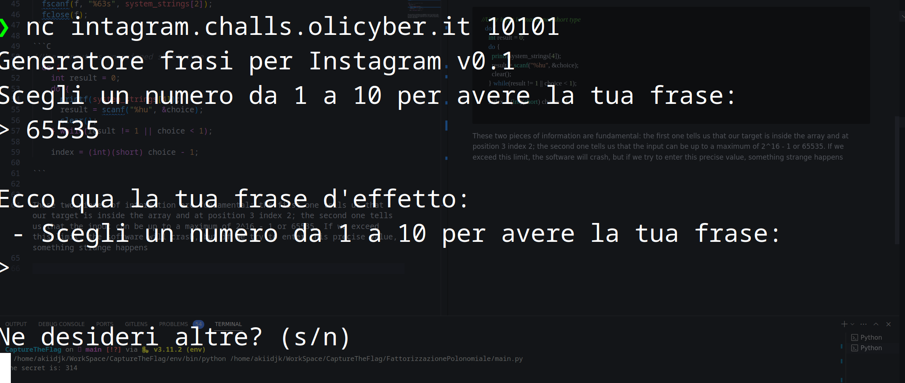

## Title

Instagram generator

## Platform
Olicyber

## Url

https://training.olicyber.it/challenges#challenge-113

## Category

Software

## Difficult

Easy

## Step

1. First things to do is download the src and run the netcat
2. the first thing is to explore a bit how the file works and already start fiddling with the numbers (always fiddling remember) well once we have played a bit we can start the real ctf so let's move onto the source 

## Solution and analysis

Once the file is open, we immediately notice a comment in which the command with which it was compiled is written


```C
// gcc -Wall -fno-stack-protector -o intagram_generator src.c
```

If we analyse the command, we can see that:

- **Wall**: Enables most warning messages during compilation. This is useful for catching potential issues in your code.
- **fno-stack-protector**: Disables stack protection. Stack protection is a security feature that adds checks to detect stack buffer overflows. Disabling it might be necessary in some scenarios, but it can introduce security risks.

So this is enough for us to realise that the code is vulnerable with attacks that corrupt the memory


```C
// The string is loaded from a file and put into a string array at position 2 
FILE* f = fopen("flag.txt", "r");
  fscanf(f, "%63s", system_strings[2]);
  fclose(f);
```

```C
//User input is unassigned short type 
  do {
    int result = 0;
    do {
      printf(system_strings[4]);
      result = scanf("%hu", &choice);
      clear();
    } while(result != 1 || choice < 1);

    index = (int)(short) choice - 1;

```


These two pieces of information are fundamental: the first one tells us that our target is inside the array and at position 3 index 2; the second one tells us that the input can be up to a maximum of 2^16 - 1 or 65535. If we exceed this limit, the software will crash, but if we try to enter this precise value, something strange happens 



We can see that once the input is entered, the string fetches the first string of the array containing the system strings where we remember our flag is present.
Once we understand this, we can try decreasing the number until we find the flag, so when we input 65533


The reason for this is surely a matter of how the number given as input is handled, but unfortunately I have not been able to reconstruct well why this happens (I am not skilled). but I'm working on an explanation for this