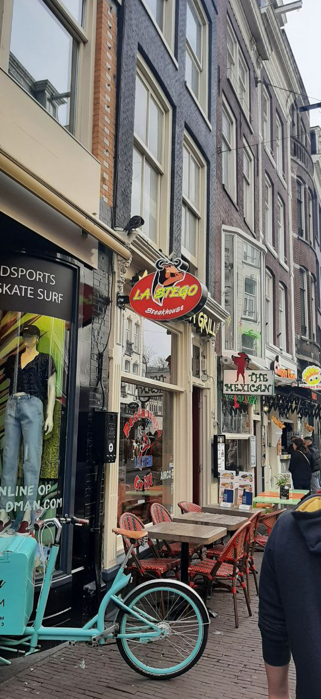

## Title

LaStego

## Platform

Olicyber

## Url

https://training.olicyber.it/challenges#challenge-274

## Category

misc

## Difficult

Easy

## Step

The image of the problems

1. The problem may initially suggest that it is shorthand, but in reality, if you do a bit of testing using tools such as OpenStego or others, you will notice that there is no useful information
2. So the next step is to look in the metadata via online tools

## Solution

If we view the metadata using [brandfolder](https://brandfolder.com) we notice that in the field "Comment:" we notice the flag